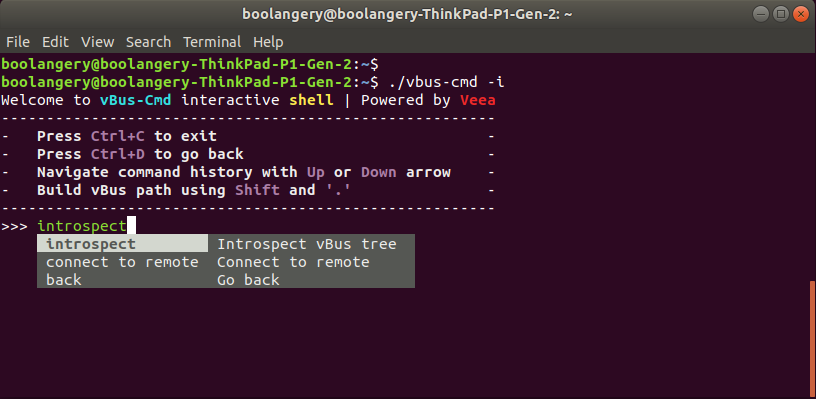
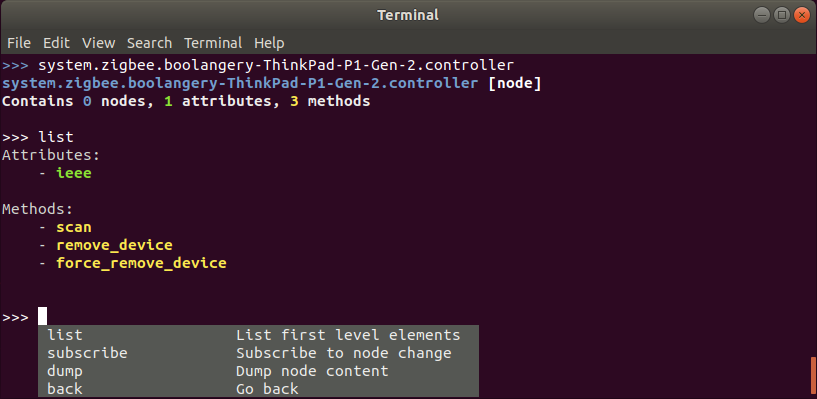

# vbus-cmd

This is the vBus command line interface.

## Usage

    NAME:
       vbus-cmd - send vbus commands (v1.1.1)
    
    USAGE:
       vbus-cmd [global options] command [command options] [arguments...]
    
       Examples:
       vbus-cmd discover system.zigbee
       vbus-cmd discover -j system.zigbee (json output)
       vbus-cmd discover -f system.zigbee (flattened output)
       vbus-cmd attribute get -t 10 system.zigbee.[...].1026.attributes.0
       vbus-cmd method call -t 120 system.zigbee.boolangery-ThinkPad-P1-Gen-2.controller.scan 120
       vbus-cmd --app=foobar node add config "{\"service_ip\":\"192.168.1.88\"}"
       vbus-cmd -p "system.foobar.>" attribute get system.foobar.local.config.service_ip
    
    DESCRIPTION:
       This command line tool allow you to run vBus commands. When running for the first time, a configuration
       file will be created in $HOME or $VBUS_PATH env. variable. So you need to have write access to this folder.
    
    ENV. VARIABLES:
       VBUS_PATH: the config path used to store the config file (optional)
       VBUS_URL: direct nats server url (optional)
    
    COMMANDS:
       discover, d   Discover elements on `PATH`
       node, n       Send a command on a remote node 
       attribute, a  Send a command on a remote attribute 
       method, m     Send a command on a remote method
       expose, e     Expose a service URI
       version, v    Display version number
       help, h       Shows a list of commands or help for one command
    
    GLOBAL OPTIONS:
       --debug, -d                   Show vBus library logs (default: false)
       --interactive, -i             Start an interactive prompt (default: false)
       --permission value, -p value  Ask a permission before running the command
       --domain value                Change domain name (default: "system")
       --app value                   Change app name (default: "vbus-cmd")
       --help, -h                    show help (default: false)


By default (when not using --domain and --app), vbus-cmd will register on vBus with this app name: `system.vbus-cmd`

---
**NOTE**

When accessing vBus elements, you need to ask permission before (-p). This is may be the reason why you get
a timeout error.

---


## Commands

### discover

    $ vbus-cmd discover system.zigbee
    {
        [...]
    }

You will get a `null` response if not elements found.

### node add

    $ vbus-cmd --domain=com --app=info node add foo "{\"data\":42}"

It will create a vBus module exposing the provided node.

You can also provide a json file:

node.json
```json
{
	"volume": 80,
	"device": {
		"name": "/dev/audio"
	}
}
```

    $ vbus-cmd --domain=com --app=audio node add --file node.json config
    2020/09/17 10:02:41 node successfully created, do not close this app (exit with Ctrl+C)

Retrieving elements:

    $ vbus-cmd discover com.audio
      {
          "boolangery-ThinkPad-P1-Gen-2": {
              "config": {
                  [...]
              }
          }
      }

Reading an attribute value:

    $ vbus-cmd -p 'com.audio.>' attribute get com.audio.boolangery-ThinkPad-P1-Gen-2.config.volume
    80

You can also use the `.local.` notation that will be replaced by current hostname: 

    $ vbus-cmd -p 'com.audio.>' attribute get com.audio.local.config.volume
    80
    
### node get

    vbus-cmd -p 'com.audio.>' node get com.audio.local.config
    {
        "device": {
            [...]
        },
        "volume": {
            [...]
        }
    }

### attribute get

Read an attribute value:

    $ vbus-cmd -p 'com.audio.>' attribute get com.audio.local.config.volume
    80

In the path the `.local.` segment will be expanded to current hostname.

### attribute set

Set an attribute value

    $ vbus-cmd -p 'com.audio.>' attribute set com.audio.local.config.volume 60
    
The value must be a valid json value. As quote are used in bash, you have to escape them when passing a
string value.

Example of valid values:

    $ "\"a string value\""
    $ '"a string value"'
    $ 60
    $ "{\"service_ip\":\"192.168.1.88\"}"
    
### method call

    $ vbus-cmd -p 'system.zigbee.>' method call 120

## Interactive mode

    vbus-cmd -i

The interactive mode allows you to introspect the vbus tree:




