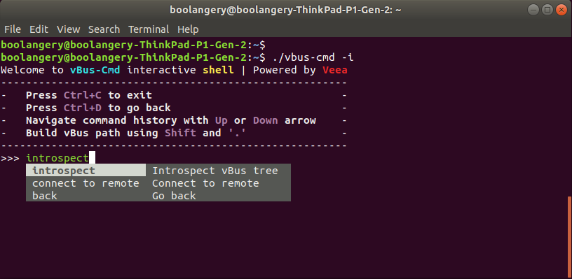
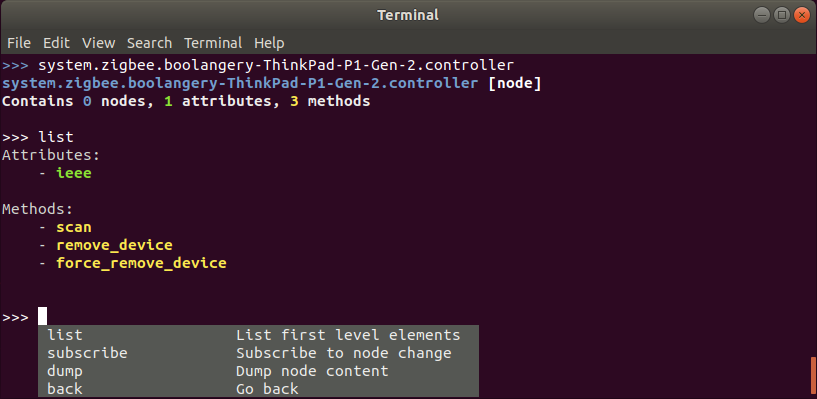

# vbus-cmd

This is the vBus command line interface.

## Usage

    NAME:
       vbus-cmd - send vbus commands
    
    USAGE:
       vbus-cmd [global options] command [command options] [arguments...]
    
       Examples:
       vbus-cmd discover system.zigbee
       vbus-cmd discover -j system.zigbee (json output)
       vbus-cmd discover -f system.zigbee (flattened output)
       vbus-cmd attribute get -t 10 system.zigbee.[...].1026.attributes.0
       vbus-cmd method call -t 120 system.zigbee.boolangery-ThinkPad-P1-Gen-2.controller.scan 120
       vbus-cmd --app=foobar node add config "{\"service_ip\":\"192.168.1.88\"}"
       vbus-cmd -p "system.foobar.>" attribute get system.foobar.local.config.service_ip
    
    COMMANDS:
       discover, d   Discover elements on `PATH`
       node, n       Send a command on a remote node 
       attribute, a  Send a command on a remote attribute 
       method, m     Send a command on a remote method
       help, h       Shows a list of commands or help for one command
    
    GLOBAL OPTIONS:
       --debug, -d                   Show vBus library logs (default: false)
       --interactive, -i             Start an interactive prompt (default: false)
       --permission value, -p value  Ask a permission before running the command
       --domain value                Change domain name (default: "system")
       --app value                   Change app name (default: "vbus-cmd")
       --help, -h                    show help (default: false)

## Interactive mode

    vbus-cmd -i

The interactive mode allows you to introspect the vbus tree:

